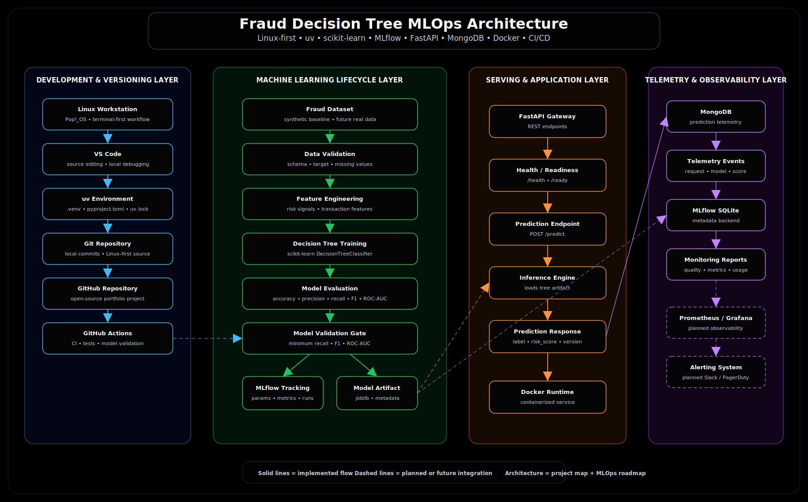
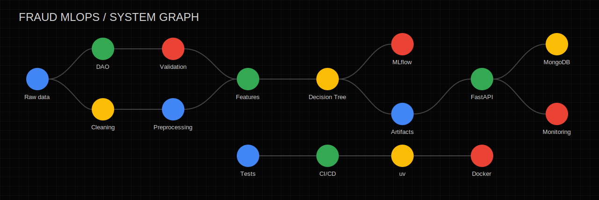

# Fraud Decision Tree MLOps

<p align="center">
  
</p>

A production-oriented fraud detection baseline that separates data access, cleaning,
validation, feature engineering, model training, serving, and telemetry. It uses a
scikit-learn Decision Tree, MLflow, FastAPI, MongoDB, Docker, GitHub Actions, and uv.

## Architecture

```text
Raw data -> Repository/DAO -> Cleaning -> Validation -> Feature engineering
         -> Decision Tree -> Evaluation -> MLflow + joblib artifact
         -> FastAPI -> MongoDB telemetry -> Monitoring queries
```

Training calls `build_training_dataset()` rather than embedding CSV and preparation
logic. Inference reuses the same feature-engineering function used by training.
Telemetry is fail-soft: MongoDB outages never block a prediction response.

<p align="center">
  
</p>

## Quick Start

Requires Python 3.11 and [uv](https://docs.astral.sh/uv/).

```bash
cp .env.example .env
uv venv --python 3.11
uv pip install -e ".[dev]"
make train
make validate
make test
make api
```

API docs are available at `http://localhost:8000/docs`.

```bash
curl -X POST http://localhost:8000/predict \
  -H 'Content-Type: application/json' \
  -d '{"transaction_id":"txn_001","transaction_amount":750.0,"transaction_hour":2,"customer_age_days":14,"num_previous_transactions":1,"merchant_risk_score":0.82,"device_risk_score":0.74}'
```

## API And Telemetry

| Endpoint | Purpose |
|---|---|
| `GET /health` | Process health |
| `GET /ready` | Model artifact readiness |
| `POST /predict` | Validate, engineer features, score, and log telemetry |
| `GET /telemetry/recent` | Return recent MongoDB events or HTTP 503 |

Each telemetry event stores request features, prediction, risk score, model identity,
and a UTC timestamp. Start the complete local stack with `make docker-up`.

## Model Lifecycle

`make train` generates synthetic raw data when needed, persists a processed dataset,
logs parameters and metrics to an SQLite-backed MLflow experiment, and writes a
joblib serving artifact. `make validate` enforces minimum recall, F1, and ROC-AUC.

| Metric | Validation floor |
|---|---:|
| Recall | 0.50 |
| F1 score | 0.35 |
| ROC-AUC | 0.60 |

Generated datasets, model files, MLflow state, and `reports/metrics.json` are ignored.
Source, tests, configs, docs, diagrams, workflows, and `uv.lock` remain tracked.

## Development Commands

| Command | Action |
|---|---|
| `make install` | Install project and development dependencies |
| `make format` | Apply Ruff fixes and Black formatting |
| `make lint` | Check Ruff and Black |
| `make test` | Run unit, integration, and contract tests |
| `make train` / `make validate` | Train and validate the baseline |
| `make api` / `make mlflow` | Run API or MLflow UI |
| `make docker-up` / `make docker-down` | Manage the local service stack |

## Project Layout

```text
src/fraud_detection/
├── data/          # DAO, cleaning, validation, preprocessing, pipeline
├── features/      # Shared feature engineering
├── models/        # Training, evaluation, prediction, explainability
├── api/           # FastAPI schemas, dependencies, and routes
├── telemetry/     # MongoDB client, event logging, monitoring queries
└── monitoring/    # Extension points for quality, drift, and performance
```

## Documentation

- [Data architecture](docs/data_architecture.md)
- [ML lifecycle](docs/ml_lifecycle.md)
- [API contract](docs/api_contract.md)
- [Telemetry](docs/telemetry.md)
- [Model card](docs/model_card.md)
- [Limitations](docs/limitations.md)

Licensed under the [MIT License](LICENSE).
